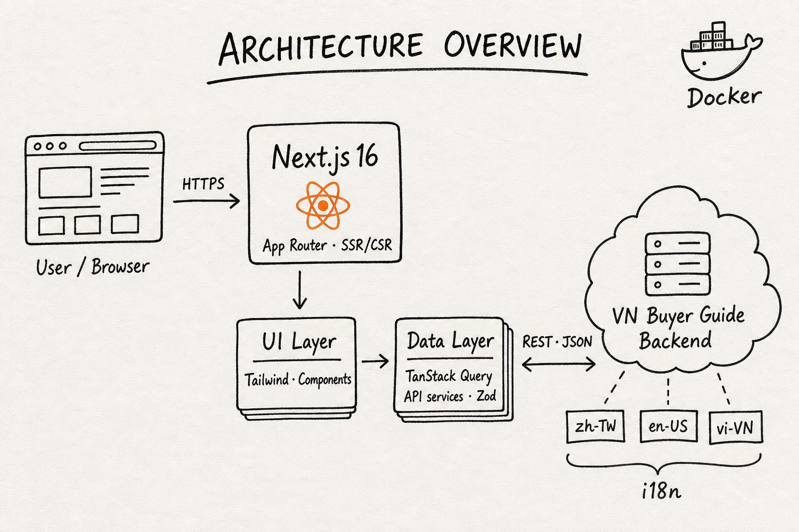

# VN Buyer's Guide - Frontend

Frontend application for the VN Buyer's Guide platform.  
It provides directory browsing, news consumption, account flows, and admin interfaces for multilingual users.

## Portfolio Highlights

- Developed with Next.js App Router and TypeScript for modern SSR/CSR hybrid rendering
- Implemented multilingual UX (`zh-TW`, `en-US`, `vi-VN`) for cross-market accessibility
- Structured frontend APIs with service + hook layers for maintainable data access
- Built responsive UI with Tailwind CSS and reusable component patterns.

## Product Scope

This frontend includes:

- Public business directory experiences
- News pages consuming backend translation pipeline output
- User account and authentication-related screens
- Admin-facing management pages

## Features

### Public & discovery
- **Home & about** — Landing and informational content for the platform
- **Business directory** — Search and browse companies; detailed company profiles with multilingual labels and metadata
- **Property listings** — Property-focused browsing experience
- **News** — News feed backed by the backend translation pipeline
- **Contact & advertising** — Contact flows for inquiries and commercial advertising (orders, scheduling, asset uploads)
- **Ad preview** — Preview advertising placements by order where supported (`/ad-preview/[orderId]`)

### Accounts & auth

- **Registration & login** — Sign-up and sign-in flows
- **Password lifecycle** — Forgot password, email-based set-password / verification after admin approval
- **Account area** — Signed-in user profile and account management
- **Legal pages** — Terms of use and privacy policy under the login area

### Admin

- **Admin console** — Management workspace for platform operators (dashboard, company/account workflows, notifications, and related tabs per backend capabilities)
- **Demo / internal tools** — Optional admin demo routes for testing or showcases

### Platform qualities

- **Multilingual UI** — End-user and admin copy in `zh-TW`, `en-US`, and `vi-VN`
- **Responsive layout** — Tailwind-based layouts for desktop and mobile
- **Typed API integration** — Feature modules use shared request/response types, service functions, and React Query hooks

## Tech Stack

- Next.js 16 (App Router)
- React 19
- TypeScript
- Tailwind CSS
- Internationalization: `zh-TW`, `en-US`, `vi-VN`

## Frontend Architecture

- **App Layer:** Next.js routes and layouts (server-first by default)
- **UI Layer:** reusable components and feature-level composition
- **Data Layer:** API module pattern with typed services and hooks
- **State Strategy:** server state through query hooks, local state only for UI concerns

## Architecture Overview

High-level sketch of how the browser talks to this app and how the app talks to backend services (hand-drawn style for quick orientation).



## Backend Integration

- Connects to VN Buyer Guide backend APIs
- Uses typed request/response models for feature modules
- Supports authenticated and public endpoints based on route requirements

## Getting Started

### Prerequisites

- Node.js LTS
- pnpm
- Optional: Docker

### Local development

```bash
pnpm install
pnpm run dev
```

Application runs at:

- `http://localhost:3000`

## Scripts


| Command          | Description              |
| ---------------- | ------------------------ |
| `pnpm install`   | Install dependencies     |
| `pnpm run dev`   | Start development server |
| `pnpm run build` | Build for production     |
| `pnpm run start` | Run production build     |
| `pnpm run lint`  | Run ESLint               |


## Docker

```bash
docker-compose up --build
docker-compose up -d --build
docker-compose down
```

## Verification Email Preview

After admin approves a company account request, the system sends an email so the user can verify and set their password.

Admin approval account verification email

## Company Advertising Order Preview

This modal allows a company to place an advertising order, choose package duration, set schedule, and upload advertising material.

Company advertising order item form

## Company Advertising Success Result

After a company advertising campaign is submitted and approved, the system displays the advertising result popup to end users.

Company advertising success result popup

## Suggested Recruiter Add-ons

To strengthen your job application README, add:

- Home, directory, news, and admin screenshots
- Short user journey (search company -> view details -> read related news)
- Performance notes (e.g., server components, route-level rendering decisions)
- Your personal contribution section (features you implemented, key challenges, outcomes)